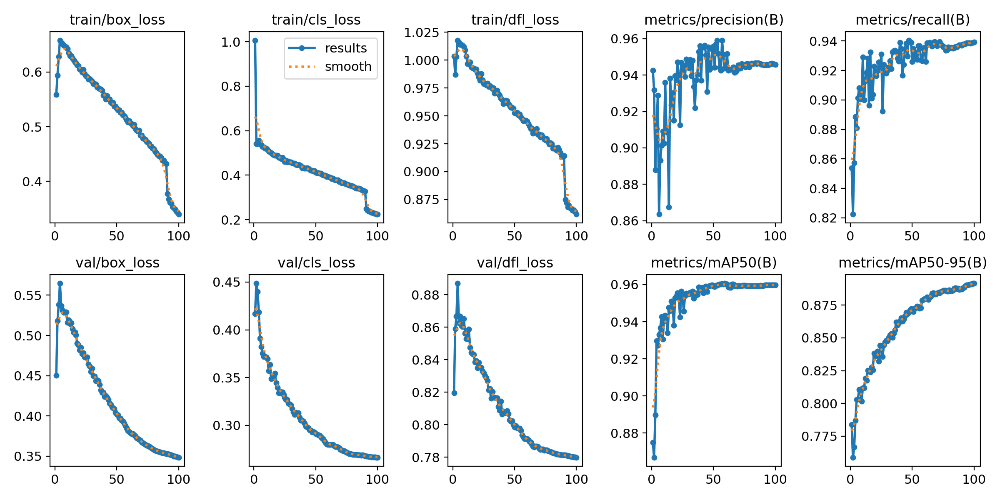

## **Recipe Recommendation**

A web-based application that detects the ingredients you have and suggests recipes accordingly. Powered by a YOLO model for ingredient detection and integrated with the Groq API for recipe suggestions, this app makes meal planning quick and simple.

## **Features**
- **Ingredient Detection**: Automatically identifies ingredients from uploaded images.
- **Recipe Suggestions**: Provides recipe ideas tailored to the detected ingredients.
- **Streamlit Interface**: Clean and interactive web interface.

## **Installation**

To install Project, follow these steps:
1. Clone the repository: **`git clone https://github.com/MonaniLokesh/recipe_recommendation.git`**
2. Navigate to the project directory: **`cd recipe_recommendation`**
3. Install dependencies: **`pip install -r requirements.txt`**
4. Create a **`.env`** file in the project directory and add your Groq API key:**`GROQ_API_KEY=your_api_key_here`**
5. Run the application:**`streamlit run app.py`**

## **Usage**
1. Use your device's camera for real-time detection of ingredients. The app will identify ingredients as they appear in the camera feed.

2. Once the ingredients are detected, the app will fetch and display recipe suggestions based on the detected ingredients.

3. You can interact with the bot by adding ingredients, specifying cuisine types, and more.

4. Choose a recipe from the suggestions and follow the steps to start cooking! 😎👨‍🍳

## **Results**

## **Technologies Used**
- **Streamlit**: For the web-based user interface.
- **YOLO Model**: Custom-trained YOLO model for ingredient detection using a custom dataset.
- **Groq API**: For recipe generation.
- **Python**: Backend logic and integration.

## **Contributing**
Contributions are welcome! If you want to contribute to this project, feel free to fork the repository and submit a pull request with your changes.

## **Contact**
For any questions or feedback, feel free to contact [lokeshmonani112@gmail.com] or open an [issue](https://github.com/MonaniLokesh/recipe_recommendation/issues/new) in the repository.